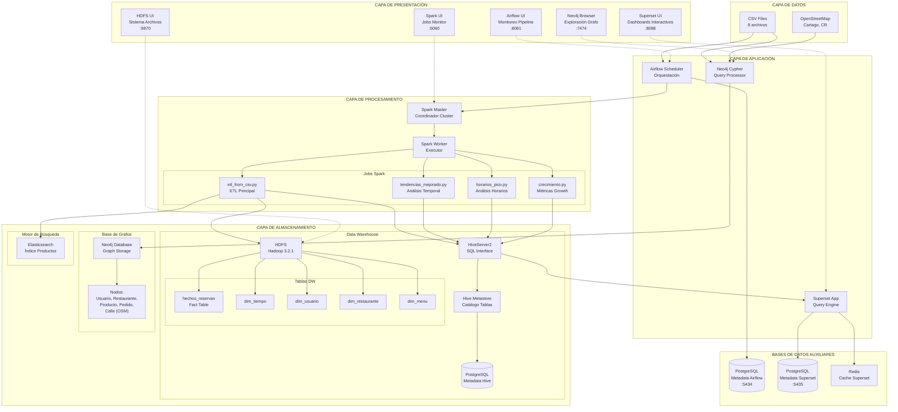
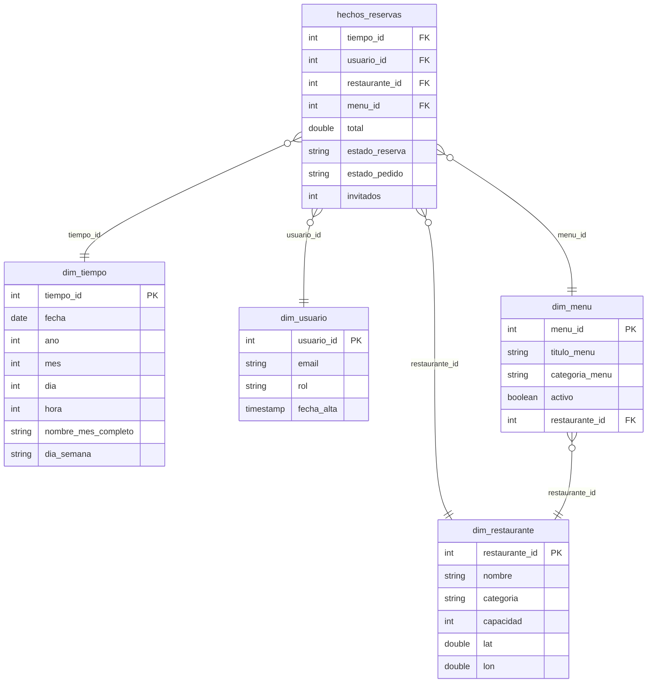
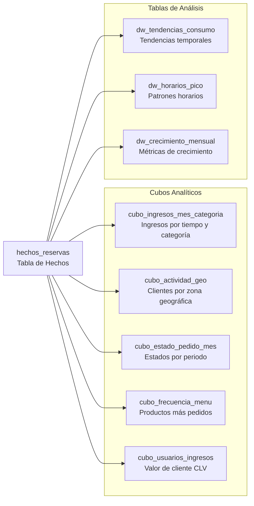
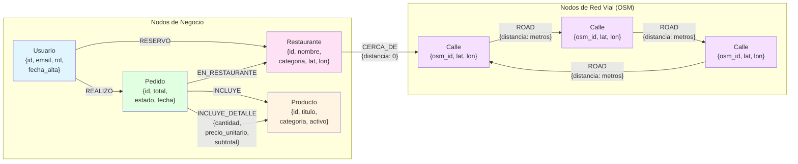
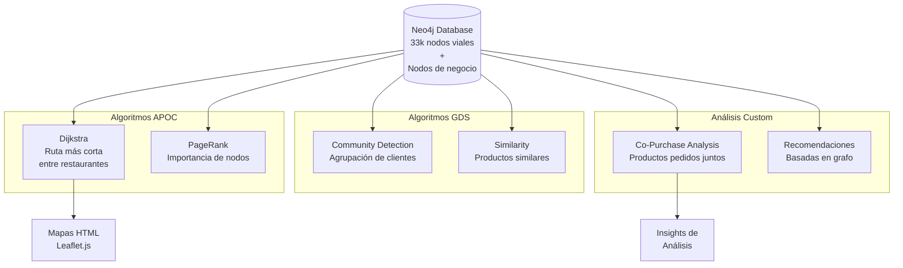
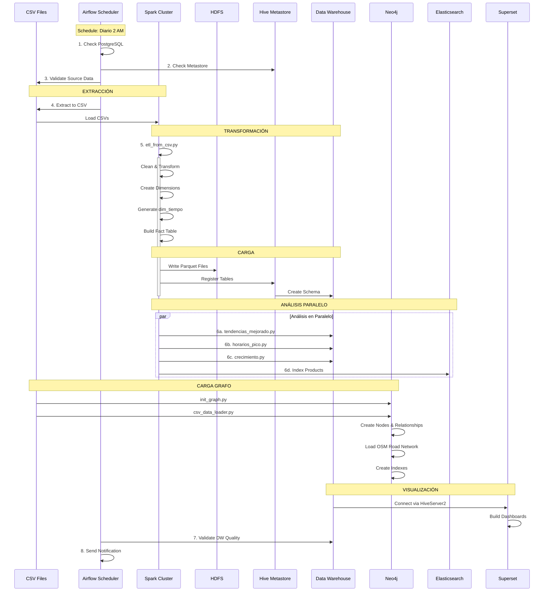
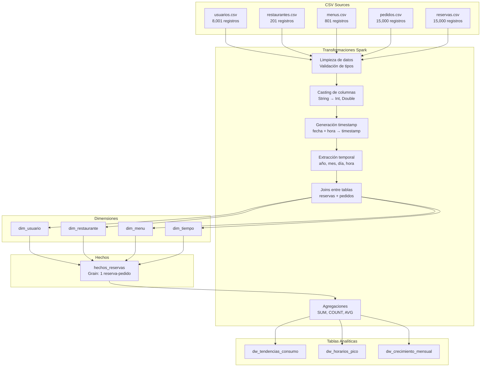
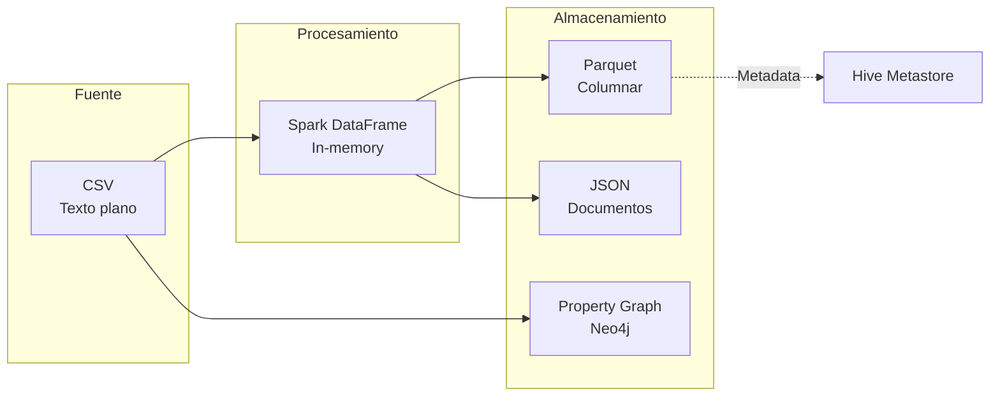
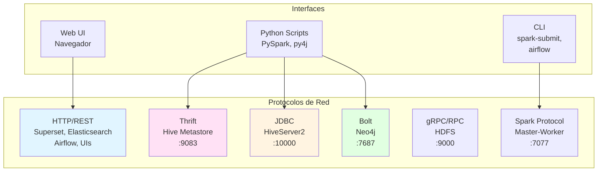
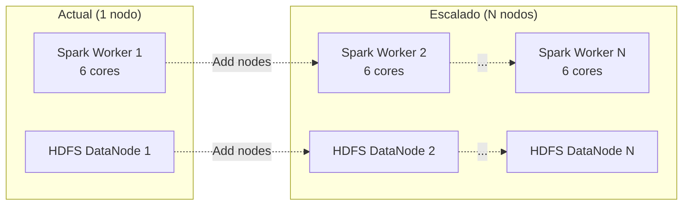

# Arquitectura Detallada - Sistema OLAP de Restaurantes

## Índice
- [Arquitectura General](#arquitectura-general)
- [Modelo de Datos OLAP](#modelo-de-datos-olap)
- [Modelo de Grafos Neo4j](#modelo-de-grafos-neo4j)
- [Flujo de Datos ETL](#flujo-de-datos-etl)
- [Stack Tecnológico](#stack-tecnológico)

---

## Arquitectura General

### Componentes del Sistema

---

## Modelo de Datos OLAP

### Esquema Estrella - Data Warehouse

### Cubos OLAP (Vistas Agregadas)

---

## Modelo de Grafos Neo4j

### Modelo Entidad-Relación de Grafos

### Algoritmos de Grafos Implementados

---

## Flujo de Datos ETL

### Pipeline Completo

### Transformaciones de Datos

---

## Stack Tecnológico

### Matriz de Componentes

| Componente | Versión | Puerto(s) | Propósito | Recursos |
|------------|---------|-----------|-----------|----------|
| **Apache Airflow** | 2.8.0 | 8081 | Orquestación pipeline ETL | 2 servicios |
| **Apache Spark** | 3.5.3 | 7077, 6060 | Procesamiento distribuido | 1 Master + 1 Worker 6 cores, 18GB RAM |
| **Apache Hive** | 3.1.3 | 10000, 9083 | Data Warehouse SQL | Metastore + HiveServer2 |
| **Hadoop HDFS** | 3.2.1 | 9870, 9000 | Almacenamiento distribuido | NameNode + DataNode |
| **Neo4j** | 5.25.1 | 7474, 7687 | Base de datos de grafos | APOC + GDS plugins |
| **Elasticsearch** | 8.11.0 | 9200 | Motor de búsqueda | Single-node, 512MB heap |
| **Apache Superset** | 3.0.0 | 8088 | Dashboards y BI | Con Redis cache |
| **PostgreSQL** | 14 | 5433-5435 | Metadatos | 3 instancias |
| **Redis** | 7 | 6379 | Cache | Para Superset |

### Formato de Datos

### Comunicación entre Servicios

---

## Características Avanzadas

### 1. Optimización de Rutas con OpenStreetMap

- **Red vial real**: 33,000 nodos de Cartago, Costa Rica
- **Algoritmo**: Dijkstra (APOC)
- **Visualización**: Mapas Leaflet.js
- **Casos de uso**: Rutas de entrega, análisis de cobertura

### 2. Análisis de Co-Compras

- **Técnica**: Graph pattern matching en Neo4j
- **Query**: Productos pedidos juntos en mismo pedido
- **Aplicación**: Recomendaciones, bundling

### 3. Procesamiento Distribuido

- **Spark**: 6 cores, 18GB RAM
- **Paralelización**: Jobs independientes en paralelo
- **Optimización**: Broadcast joins, Parquet columnar

### 4. Pipeline Automatizado

- **Frecuencia**: Diario a las 2 AM
- **Reintentos**: 1 retry automático
- **Notificaciones**: Email en éxito/fallo
- **Validaciones**: Calidad de datos pre y post-carga

### 5. Multi-Modelo de Datos

- **OLAP**: Esquema estrella en Hive
- **Grafo**: Property graph en Neo4j
- **Búsqueda**: Índices invertidos en Elasticsearch
- **Integración**: Datos relacionados entre modelos

---

## Escalabilidad

### Horizontal Scaling

### Despliegue en Kubernetes

- **Manifiestos**: Disponibles en `k8s/`
- **Namespaces**: Aislamiento de recursos
- **Secrets**: Gestión de credenciales
- **Ingress**: Exposición de servicios
- **Kustomize**: Configuración multi-entorno

---

## Seguridad

### Autenticación

| Servicio | Método | Credenciales |
|----------|--------|--------------|
| Airflow | Basic Auth | admin / admin |
| Superset | Session-based | admin / admin |
| Neo4j | Native Auth | neo4j / restaurantes123 |
| PostgreSQL | Password | hive / hive123, etc. |

### Redes Docker

- **olapnet**: Red interna aislada
- **mongo-cluster**: Red externa (futura integración)
- Sin exposición directa de puertos críticos

---

## Monitoreo

### Interfaces de Administración

| UI | URL | Métricas |
|----|-----|----------|
| Airflow | :8081 | DAG runs, task duration, failures |
| Spark | :6060 | Jobs, stages, executors, storage |
| HDFS | :9870 | Datanodes, disk usage, replication |
| Superset | :8088 | Query performance, cache hit rate |
| Neo4j | :7474 | Query performance, store size |

---

## Conclusión

Esta arquitectura implementa un **stack completo de Big Data** con:

✅ Data Warehouse OLAP (esquema estrella)
✅ Procesamiento distribuido (Spark)
✅ Orquestación automatizada (Airflow)
✅ Análisis de grafos (Neo4j + OSM)
✅ Búsqueda full-text (Elasticsearch)
✅ Visualización avanzada (Superset)
✅ Despliegue containerizado (Docker + K8s)

**Capacidades analíticas**:
- OLAP multidimensional
- Optimización de rutas
- Recomendaciones basadas en grafos
- Análisis temporal y tendencias
- Métricas de negocio (CLV, churn, growth)
