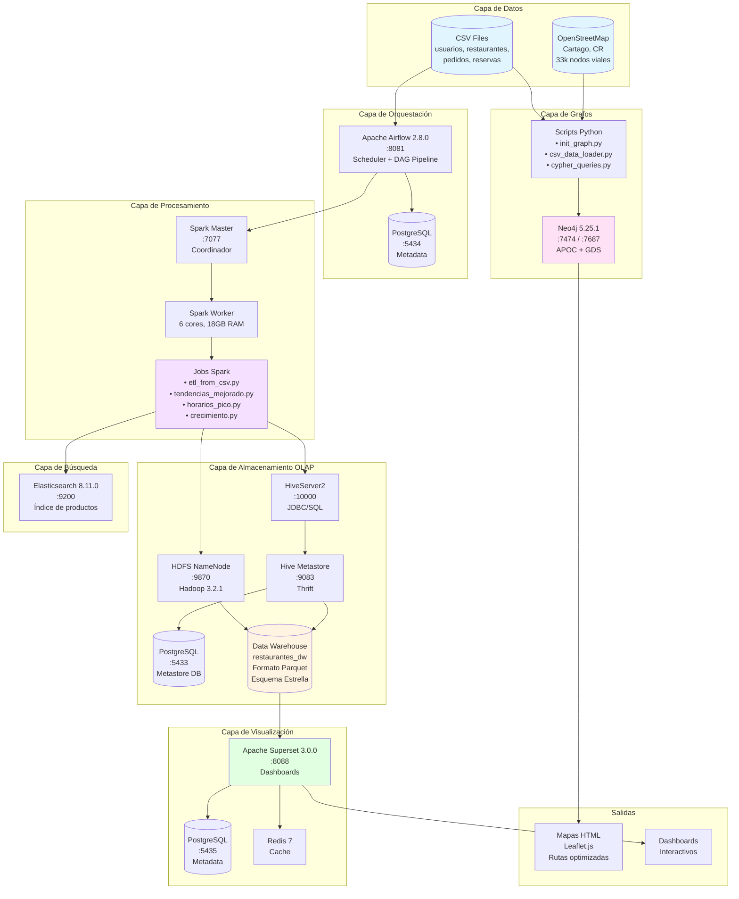

# Sistema OLAP de Restaurantes - Plataforma Analitica

Plataforma de analitica de datos para el dominio de restaurantes, construida sobre un stack de Big Data con Apache Spark, Hive, Airflow, Neo4j y Superset. Implementa un Data Warehouse con esquema estrella, procesamiento distribuido, analisis de grafos y optimizacion de rutas de entrega sobre datos viales reales de Cartago, Costa Rica.

---

## Arquitectura del Sistema



---

## Servicios y Puertos

| Servicio              | Puerto | URL / Acceso                        | Credenciales            |
|-----------------------|--------|-------------------------------------|-------------------------|
| Apache Airflow        | 8081   | http://localhost:8081               | admin / admin           |
| Apache Superset       | 8088   | http://localhost:8088               | admin / admin           |
| Neo4j Browser         | 7474   | http://localhost:7474               | neo4j / restaurantes123 |
| Neo4j Bolt            | 7687   | bolt://localhost:7687               | neo4j / restaurantes123 |
| Spark Master UI       | 6060   | http://localhost:6060               | --                      |
| HDFS NameNode UI      | 9870   | http://localhost:9870               | --                      |
| HiveServer2           | 10000  | jdbc:hive2://localhost:10000        | --                      |
| Hive Metastore        | 9083   | thrift://localhost:9083             | --                      |
| Elasticsearch         | 9200   | http://localhost:9200               | --                      |
| Spark Master          | 7077   | spark://localhost:7077              | --                      |
| PostgreSQL (Metastore)| 5433   | localhost:5433                      | hive / hive123          |
| PostgreSQL (Airflow)  | 5434   | localhost:5434                      | airflow / airflow       |
| PostgreSQL (Superset) | 5435   | localhost:5435                      | superset / superset123  |

---

## Inicio Rapido

### Prerrequisitos

- Docker y Docker Compose
- Al menos 16 GB de RAM disponibles
- Python 3.8+ (para scripts locales opcionales)

### Levantar el sistema

```bash
# Crear red externa de Docker (solo si no existe)
docker network create mongo-cluster

# Levantar todos los servicios (olapnet se crea automaticamente)
docker compose up -d
```

### Inicializacion automatica

El contenedor `auto-init` ejecuta automaticamente la siguiente secuencia al iniciar:

1. Espera a que todos los servicios esten saludables
2. Ejecuta el ETL principal con Spark (`etl_from_csv.py`)
3. Ejecuta los jobs de analisis (tendencias, crecimiento, horarios pico)
4. Carga los datos en Neo4j (entidades + red vial OpenStreetMap)
5. Ejecuta las consultas analiticas de Cypher

### Verificar el estado

```bash
# Ver logs del proceso de inicializacion
docker logs -f auto-init

# Verificar que todos los servicios estan corriendo
docker compose ps
```

### Detener el sistema

```bash
docker compose down
```

Para eliminar tambien los volumenes de datos:

```bash
docker compose down -v
```

---

## Data Warehouse - Esquema Estrella

La base de datos `restaurantes_dw` en Hive implementa un esquema estrella con el siguiente diseno:

### Tabla de Hechos

**hechos_reservas** - Tabla central que registra cada transaccion (reserva + pedido):
- `tiempo_id` (FK), `usuario_id` (FK), `restaurante_id` (FK), `menu_id` (FK)
- `total`, `estado_reserva`, `estado_pedido`, `invitados`

### Dimensiones

| Dimension        | Campos principales                                    |
|------------------|-------------------------------------------------------|
| dim_tiempo       | fecha, ano, mes, dia, hora, dia_semana                |
| dim_usuario      | email, rol, fecha_alta                                |
| dim_restaurante  | nombre, categoria, capacidad, lat, lon                |
| dim_menu         | titulo_menu, categoria_menu, activo, restaurante_id   |

### Formato de almacenamiento

Todas las tablas se almacenan en formato Apache Parquet sobre HDFS en `/user/hive/warehouse/restaurantes_dw.db/`.

---

## Cubos OLAP

Se definen cinco vistas analiticas como cubos OLAP en Hive:

| Cubo                          | Descripcion                                              |
|-------------------------------|----------------------------------------------------------|
| cubo_ingresos_mes_categoria   | Ingresos totales agrupados por mes y categoria de menu   |
| cubo_actividad_geo            | Clientes unicos y reservas por zona geografica            |
| cubo_estado_pedido_mes        | Distribucion de estados de pedido por periodo             |
| cubo_frecuencia_menu          | Ranking de productos mas solicitados                      |
| cubo_usuarios_ingresos        | Gasto total y numero de reservas por usuario              |

Estas vistas se pueden consultar directamente desde Superset o mediante conexion JDBC a HiveServer2.

---

## Jobs de Spark

Los jobs de procesamiento se encuentran en `spark/jobs/`:

| Archivo                | Descripcion                                             |
|------------------------|---------------------------------------------------------|
| etl_from_csv.py        | ETL principal: lee CSV, transforma y carga al DW        |
| tendencias_mejorado.py | Analisis de tendencias de ventas por mes y categoria    |
| tendencias.py          | Version simplificada del analisis de tendencias         |
| crecimiento.py         | Metricas de crecimiento mensual de ingresos             |
| horarios_pico.py       | Identificacion de franjas horarias de mayor actividad    |

### Ejecutar un job manualmente

```bash
docker exec -it spark-master spark-submit \
  --master spark://spark-master:7077 \
  --deploy-mode client \
  /opt/spark/jobs/etl_from_csv.py
```

---

## Orquestacion con Airflow

El DAG principal se encuentra en `airflow/dags/restaurantes_etl_dag.py` y coordina la ejecucion del pipeline ETL completo.

Para acceder a la interfaz web de Airflow:

1. Abrir http://localhost:8081
2. Credenciales: admin / admin
3. Activar el DAG `restaurantes_etl_pipeline`

### Flujo del Pipeline

El DAG ejecuta 12 tareas en el siguiente orden:
1. Verificaciones iniciales (PostgreSQL + Hive Metastore)
2. Validacion de datos fuente
3. Extraccion de datos a CSV
4. ETL principal con Spark
5. Analisis paralelos (tendencias, horarios, crecimiento, indexacion)
6. Validacion de calidad del DW
7. Notificaciones de exito/fallo

**Schedule**: Diario a las 2 AM (`0 2 * * *`)

---

## Modelo de Grafos - Neo4j

### Nodos

| Etiqueta     | Descripcion                          | Propiedades principales            |
|--------------|--------------------------------------|------------------------------------|
| Usuario      | Clientes de la plataforma            | id, email, rol                     |
| Restaurante  | Establecimientos registrados         | id, nombre, categoria, lat, lon    |
| Producto     | Items del menu                       | id, titulo, categoria, precio      |
| Pedido       | Pedidos realizados                   | id, total, estado, fecha           |
| Reserva      | Reservaciones                        | id, estado, fecha, invitados       |
| Calle        | Nodos de la red vial (OSM)           | osm_id, lat, lon                   |

### Relaciones

| Relacion         | Origen       | Destino      | Propiedades                           | Descripcion                           |
|------------------|--------------|--------------|---------------------------------------|---------------------------------------|
| REALIZO          | Usuario      | Pedido       | --                                    | El usuario realizo el pedido          |
| EN_RESTAURANTE   | Pedido       | Restaurante  | --                                    | El pedido fue hecho en el restaurante |
| INCLUYE          | Pedido       | Producto     | --                                    | El pedido incluye el producto         |
| INCLUYE_DETALLE  | Pedido       | Producto     | cantidad, precio_unitario, subtotal   | Detalle del producto en el pedido     |
| RESERVO          | Usuario      | Restaurante  | --                                    | El usuario realizo una reserva        |
| CERCA_DE         | Restaurante  | Calle        | distancia: 0                          | Anclaje al nodo vial mas cercano      |
| ROAD             | Calle        | Calle        | distancia (metros)                    | Segmento vial con peso en metros      |

### Consultas de ejemplo

```cypher
-- Ruta mas corta entre un restaurante y otro usando Dijkstra
MATCH (r1:Restaurante {id: 1})-[:CERCA_DE]->(inicio:Calle),
      (r2:Restaurante {id: 2})-[:CERCA_DE]->(fin:Calle)
CALL apoc.algo.dijkstra(inicio, fin, 'ROAD', 'distancia')
YIELD path, weight
RETURN path, weight AS distancia_metros;

-- Productos mas pedidos juntos (co-compras)
MATCH (p1:Producto)<-[:INCLUYE_DETALLE]-(pedido:Pedido)-[:INCLUYE_DETALLE]->(p2:Producto)
WHERE p1.id < p2.id
RETURN p1.titulo, p2.titulo, COUNT(*) AS veces_juntos
ORDER BY veces_juntos DESC
LIMIT 10;

-- Clientes con mas pedidos realizados
MATCH (u:Usuario)-[r:REALIZO]->(p:Pedido)
RETURN u.email, COUNT(p) AS total_pedidos, SUM(p.total) AS gasto_total
ORDER BY total_pedidos DESC
LIMIT 10;
```

---

## Optimizacion de Rutas - Cartago, Costa Rica

El sistema carga datos viales de OpenStreetMap (`map.osm`) correspondientes a la zona de Cartago, Costa Rica. La red vial se modela como nodos `:Calle` conectados por relaciones `:ROAD` con peso proporcional a la distancia en metros.

Se utiliza el algoritmo de Dijkstra (via APOC y GDS de Neo4j) para calcular rutas optimas de entrega. Los resultados se visualizan como mapas interactivos generados con Leaflet.js, disponibles en el directorio `visualizaciones/`:

- `route_map_cliente3_rest1.html`
- `route_map_cliente5_rest2.html`
- `route_map_cliente11_rest3.html`

---

## Dashboards con Superset

Apache Superset se conecta al Data Warehouse en Hive para generar visualizaciones interactivas.

### Acceso

1. Abrir http://localhost:8088
2. Credenciales: admin / admin

### Consultas disponibles

Las consultas SQL predefinidas para los dashboards se encuentran en `superset/dashboard_queries.sql`. Cubren metricas de ventas, tendencias temporales y KPIs de restaurantes.

### Configuracion de la conexion a Hive

La cadena de conexion SQLAlchemy para Hive en Superset es:

```
hive://hive@hive:10000/restaurantes_dw
```

---

## Despliegue en Kubernetes

Los manifiestos de Kubernetes se encuentran en el directorio `k8s/`:

```bash
# Crear namespace
kubectl apply -f k8s/namespace.yaml
```

La configuracion de los servicios de Big Data (Spark, Hive, Airflow) en Kubernetes requiere ajustes segun la infraestructura del cluster disponible. Consultar la documentacion de cada herramienta para los operadores de Kubernetes correspondientes (por ejemplo, Spark Operator).

---

## Datos de Muestra

Los datos CSV de ejemplo se encuentran en `spark/data/` e incluyen:

| Archivo              | Contenido                        |
|----------------------|----------------------------------|
| usuarios.csv         | Usuarios de la plataforma        |
| restaurantes.csv     | Restaurantes registrados         |
| menus.csv            | Menus disponibles                |
| productos.csv        | Productos del catalogo           |
| pedidos.csv          | Historial de pedidos             |
| detalles_pedido.csv  | Detalle de cada pedido           |
| reservas.csv         | Historial de reservaciones       |
| resumen_completo.json| Resumen consolidado de datos     |

---

## Estructura del Proyecto

```
restaurantes-olap/
|-- airflow/
|   |-- dags/
|   |   +-- restaurantes_etl_dag.py    # DAG principal de ETL
|   +-- plugins/
|-- spark/
|   |-- jobs/                          # Jobs de procesamiento
|   |-- data/                          # Datos CSV y JSON de muestra
|   +-- conf/                          # Configuracion de Spark
|-- hive/
|   |-- init_star.sql                  # DDL del esquema estrella
|   |-- conf/                          # Configuracion de Hive
|   |-- Dockerfile                     # Imagen de Hive
|   +-- entrypoint.sh
|-- neo4j/
|   |-- scripts/                       # Scripts Python de inicializacion y consultas
|   |-- import/                        # Datos CSV para importacion
|   |-- conf/                          # Configuracion de Neo4j
|   +-- docker-compose.neo4j.yml       # Compose independiente de Neo4j
|-- superset/
|   |-- superset_config.py             # Configuracion de Superset
|   |-- dashboard_queries.sql          # Consultas SQL para dashboards
|   +-- minimal_config.py
|-- visualizaciones/                   # Mapas HTML de rutas generadas
|-- k8s/                               # Manifiestos de Kubernetes
|-- data/                              # Datos adicionales del proyecto
|-- drivers/                           # Drivers JDBC
|-- docker-compose.yml                 # Configuracion Docker Compose completa
|-- Dockerfile.airflow                 # Imagen de Airflow personalizada
|-- map.osm                            # Datos viales OpenStreetMap (Cartago, CR)
+-- visualize_route.py                 # Generador de mapas de rutas
```
